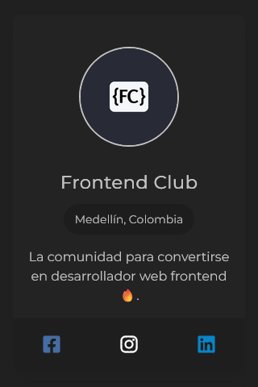
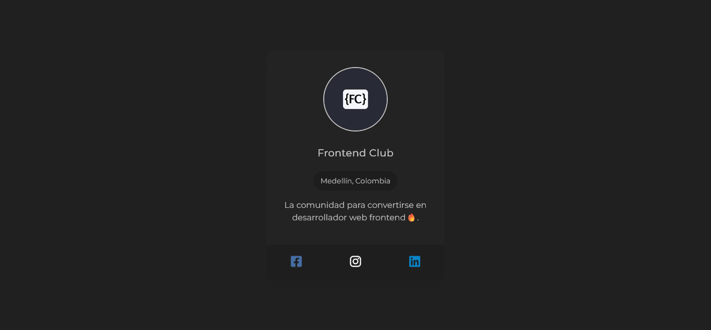

# Profile Card - Solution


Esta es una solución al primer desafío #100DaysOfProjects. La mejor manera de escribir un buen código es programando todos los días🔥.

## Tabla de contenidos

- [Vision general](#vision-general)
  - [El desafio](#el-desafio)
  - [Capturas](#capturas-de-pantalla)
  - [Enlaces](#enlaces)
- [Proceso de trabajo](#proceso-de-trabajo)
  - [Desarrollo](#desarrollo)
  - [Lo que aprendi](#lo-que-aprendi)
  - [Lo que aprendere](#lo-que-aprendere)
  - [Recursos](#recursos)
- [Autor](#autor)
- [Agradecimientos](#agradecimientos)

## Vision general

### El desafio

Se requiere desarrollar una **tarjeta de presentación** con los datos del desarrollador en HTML/CSS nativo. Si no se te ocurren tus propios datos, puedes usar los datos de la imagen de ejemplo.

1. La tarjeta debe incorporar una fotografía/avatar del usuario.
2. Los datos del usuario: **Nombre**, **lugar de residencia**, **descripción**, y enlaces a sus redes sociales
3. La estructura y posición de los elementos debe ser lo más similar al de la imagen.

### Capturas de pantalla




### Enlaces

El proyecto se encuentra alojado en un hosting gratuito(Netlify):

- [Pagina web](https://fc-profile-card.netlify.app/)
- [Codigo fuente](https://github.com/frontend-club/01-day-profile-card)
- [Codepen](https://codepen.io/frontend-club/pen/OJdYvQL)

## Proceso de trabajo

### Desarrollo

- Marcado HTML
- Propiedades CSS
- Flujo de trabajo _mobile-first_

### Lo que aprendi

Aprendimos a usar la [metodologia BEM](https://getbem.com/introduction/), procuramos emplear de la mejor manera.
Este es el marcado HTML con BEM.

```html
<main class="container">
  <div class="card">
    <div class="card__header">
      
    </div>
    <div class="card__body">
      <h1 class="card__title">Frontend Club</h1>
      <span class="card__tag">Medellín, Colombia</span>
      <p class="card__copy">
        La comunidad para convertirse en desarrollador web frontend🔥.
      </p>
    </div>
    <footer class="card__footer">
      <ul class="list">
        <li class="list__item">
          <a href="#" class="list--fb"
            ><i class="fa-brands fa-square-facebook"></i
          ></a>
        </li>
        <li class="list__item">
          <a href="#" class="list--ig"
            ><i class="fa-brands fa-instagram"></i
          ></a>
        </li>
        <li class="list__item">
          <a href="#" class="list--li"><i class="fa-brands fa-linkedin"></i></a>
        </li>
      </ul>
    </footer>
  </div>
</main>
```

Custom Properties (propiedades personalizadas)

Las **CSS Custom Properties** (**_muchas veces conocidas por variables CSS_**) son un mecanismo de CSS que permite dar **un valor personalizado** a las propiedades. El objetivo principal suele ser evitar escribir múltiples veces ese valor, y en su lugar, ponerle un nombre más lógico y fácil de recordar, que hará referencia al valor real.

```css
* {
  --primary-font-family: "Montserrat", sans-serif;
  --font-size: 1rem;
  --lh-text: 1.5rem;

  --body-bg-color: #212020;
  --card-bg-color: #242323;
  --tag-color: #1e1d1d;
  --footer-bg-color: #1f1e1e;
  --text-color: #c2c2c2;

  --fb-bg-color: #456da4;
  --ig-bg-color: #ffffff;
  --li-bg-color: #0984c6;
}
```

### Lo que aprendere

Investigaré más sobre especificidad, herencia, cascada en CSS, y más sobre la metodología BEM.

### Recursos

Hemos recopilado una lista de recursos e información valiosa que puede ayudarte a comprender mejor la realización de este hermoso proyecto:

- [FontAwesome](https://fontawesome.com/icons) - Librería de íconos.
- [BEM Cheat Sheet](https://bem-cheat-sheet.9elements.com/) - Página web con ejemplos e información sobre la metodología BEM.
- [How to Develop and Test a Mobile-First Design in 2021](https://css-tricks.com/how-to-develop-and-test-a-mobile-first-design-in-2021/) - El concepto _mobile-first_

## Autor

Nuestro canales sociales para saber más sobre los contenidos e ideas que compartimos:

- [Facebook](https://www.facebook.com/frontendclubfb)
- [Instagram](https://www.instagram.com/frontendclubig/)
- [LinkedIn](https://www.linkedin.com/in/frontendclub/)
- [Tik Tok](https://www.tiktok.com/@frontendclub)
- [Twitch](https://www.twitch.tv/frontendclub)
- [Blog](https://frontend-club.bullet.site/)

## Agradecimientos

Agradecemos a los miembros de la comunidad Frontend Club, que nos inspiran a seguir creando contenido y compartiendo iniciativas para ayudar a mejorar las habilidades en HTML, CSS, JavaScript y Git.

> “Yo puedo hacer cosas que tú no puedes, tú puedes hacer cosas que yo no puedo; juntos podemos hacer grandes cosas”. — Madre Teresa de Calcuta.
